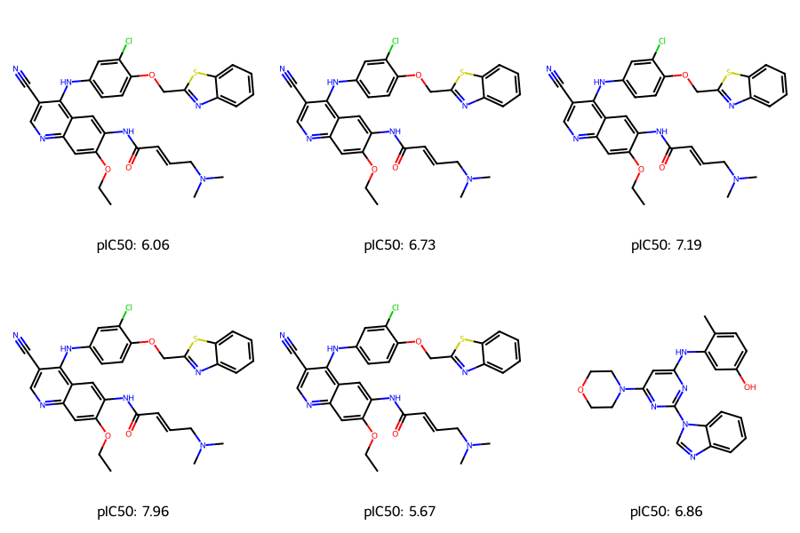
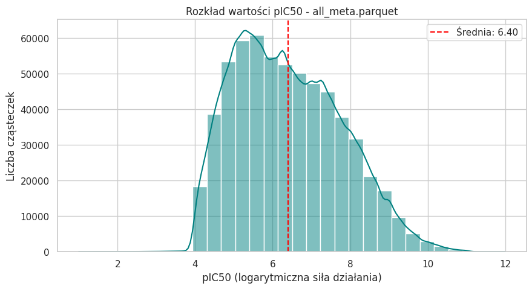

# ChEMBL Data Processing Pipeline

A scalable data processing pipeline for ChEMBL database analysis using Apache Spark and Airflow, with RDKit integration for molecular processing.

## Overview

This project provides an end-to-end solution for processing and analyzing ChEMBL bioactivity data. It includes:

- **Data Extraction**: Pulls data from ChEMBL PostgreSQL database
- **Data Processing**: Cleans, transforms, and enriches the data
- **Feature Engineering**: Generates molecular descriptors and graph representations
- **Workflow Orchestration**: Managed via Apache Airflow
- **Scalable Processing**: Leverages Apache Spark for distributed computing

## Features

- **Multiple Dataset Variants**: Process data with different configurations (EGFR-specific, human-only, etc.)
- **Graph Representations**: Convert SMILES to molecular graphs for ML applications
- **Data Quality Control**: Automated filtering and validation
- **Scalable Architecture**: Designed to handle large datasets

## Prerequisites

- Docker and Docker Compose
- Python 3.8+
- Apache Spark 3.0+
- Apache Airflow 2.0+
- RDKit for molecular processing

## Project Structure

```
chemblEDA/
├── spark_airflow/
│   ├── data_platform/             # Main data platform components
│   │   ├── dags/                  # Airflow DAG definitions
│   │   │   ├── chembl_dag.py      # Main processing DAG
│   │   │   └── afdatasets_dag.py  # DAG with Airflow Datasets generation
│   │   ├── data_share/            # Shared data and processing code
│   │   │   ├── pipeline.py        # Main Spark processing pipeline
│   │   │   ├── sql/               # SQL query templates
│   │   │   │   └── allorgs.sql    # Main SQL query for data extraction
│   │   │   └── runs/              # Output directory for processed data
│   │   └── docker-compose.yml     # Docker Compose for local development
│   │
│   ├── extended_airflow/          # Custom Airflow extensions
│   │   ├── Dockerfile            # Custom Airflow image configuration
│   │   └── build.sh              # Build script for custom image
│   │
│   └── extended_spark/            # Custom Spark extensions
│       ├── Dockerfile            # Custom Spark image configuration
│       └── build.sh              # Build script for custom image
│
└── eda/                           # Exploratory data analysis notebooks
```

## Getting Started

1. **Clone the repository**
   ```bash
   git clone <repository-url>
   cd chemblEDA
   ```

2. **Set up Postgres container with ChEMBL data**

3. **Build and start services**
   ```bash
   docker-compose -f spark_airflow/data_platform/docker-compose.yml up -d
   ```

4. **Access Airflow UI**
   Open `http://localhost:8081` in your browser (default credentials: admin/admin)

## Available DAGs

### chembl_processing_pipeline
Processes ChEMBL data with various configurations:
- Target-specific processing (EGFR, etc.)
- Organism filtering (Human-only or all organisms)
- Feature modes (with metadata or graph-only)

### chembl_processing_pipeline_with_datasets
Extended pipeline that produces Airflow Datasets for data-aware scheduling.

## Configuration

### Dataset Variants

The pipeline can generate different dataset variants:

| ID | Target | Organism Scope | Feature Mode |
|----|--------|----------------|--------------|
| human_egfr_meta | EGFR | HUMAN | WITH_METADATA |
| human_egfr_graph | EGFR | HUMAN | GRAPH_ONLY |
| all_egfr_meta | EGFR | ALL | WITH_METADATA |
| all_egfr_graph | EGFR | ALL | GRAPH_ONLY |
| human_meta | ALL | HUMAN | WITH_METADATA |
| human_graph | ALL | HUMAN | GRAPH_ONLY |
| all_meta | ALL | ALL | WITH_METADATA |
| all_graph | ALL | ALL | GRAPH_ONLY |

### Generated dataset statistics
Check ready_datasets/datasets_after_eda/verify_chembl_datasets.ipynb, and section "After EDA" in the notebook for detailed statistics and insights on the generated datasets.
### Generated all_meta.parquet statistics
| Metric | Value |
| :--- | :--- |
| **Record Count** | **608,899** |
| **Feature Count (Columns)** | 37 |
| **Structure Column (SMILES)** | `canonical_smiles` |
| **Target Variable** | `target` (pChEMBL Value) |

<details>
<summary><b>Click to expand full column list</b></summary>

* **Identifiers:** `canonical_smiles`, `chembl_id`, `graph_data`
* **Target:** `target`
* **Physicochemical Features:** `mw_freebase`, `alogp`, `hba`, `hbd`, `psa`, `rtb`, `num_ro5_violations`
* **Measurement Types (One-Hot):** `type_AC50`, `type_EC50`, `type_GI50`, `type_IC50`, `type_Kd`, `type_Ki`
* **BioAssay Ontology (One-Hot):** `bao_BAO_0000019` ... `bao_BAO_0000366`
* **Organisms (One-Hot):** `org_Homo sapiens`, `org_Mus musculus`, `org_Rattus norvegicus`, `org_Human immunodeficiency virus 1`, `org_Other`, `org_Unknown`

</details>

The table below presents the distribution of key numerical features.
*Note the scaled features (Mean ≈ 0, Std ≈ 1).*

| Feature | Count | Mean | Std | Min | 50% (Median) | Max |
| :--- | :--- | :--- | :--- | :--- | :--- | :--- |
| **target** (pIC50) | 608,899 | **6.40** | 1.37 | 1.00 | 6.26 | 12.00 |
| **hba** (H-Bond Acceptors) | 608,899 | **5.74** | 2.46 | 0.00 | 5.00 | 29.00 |
| **num_ro5_violations** | 608,899 | **0.55** | 0.80 | 0.00 | 0.00 | 4.00 |
| **mw_freebase** (scaled) | 608,899 | *~0.00* | *1.00* | -3.22 | -0.10 | 4.47 |
| **alogp** (scaled) | 608,899 | *~0.00* | *1.00* | -9.11 | -0.00 | 7.70 |
| **rtb** (scaled) | 608,899 | *~0.00* | *1.00* | -1.20 | 0.12 | 12.58 |

Organism Distribution (Top)
* **Homo sapiens:** 54.1%
* **Unknown:** 34.2%
* **Rattus norvegicus:** 4.6%
* **Mus musculus:** 1.4%
* **Other:** 5.0%




### Data Processing

The pipeline performs the following data processing steps:
1. Data extraction from ChEMBL database
2. Quality filtering and cleaning
3. Unit standardization
4. pIC50 calculation
5. Feature engineering
6. Molecular graph generation

## Resources

- [ChEMBL Database](https://www.ebi.ac.uk/chembl/)
- [Apache Spark Documentation](https://spark.apache.org/docs/latest/)
- [Apache Airflow Documentation](https://airflow.apache.org/docs/)
- [RDKit Documentation](https://www.rdkit.org/docs/)
