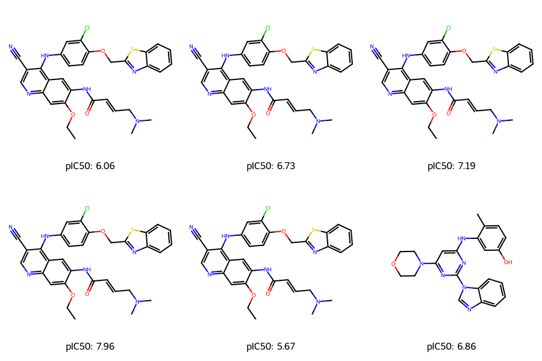
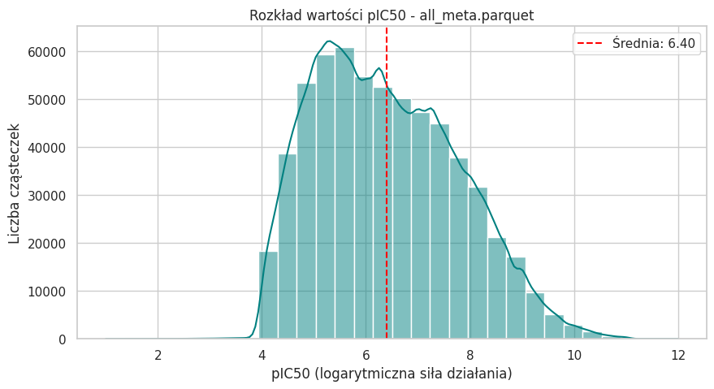

# ChEMBL Drug Discovery Platform

End-to-end pipeline for ChEMBL bioactivity data: distributed ETL on Spark + Airflow, GNN training (HybridGINE), and an interactive Streamlit agent (Ollama / Gemini / OpenAI compatible) that predicts pIC50 from SMILES.

## Overview

Three layers, each independently runnable:

1. **Preprocessing** (`preprocessing/`) - Airflow DAGs orchestrate Spark jobs that pull ChEMBL from PostgreSQL, clean, deduplicate, standardize and emit Parquet variants (per target, per organism, with/without metadata). Optionally builds molecular graphs from SMILES via RDKit.
2. **Training** (`training/`) - PyTorch + `torch_geometric` training of **HybridGINE**, a hybrid Graph Isomorphism Network with edge features (GINEConv) combined with tabular molecular descriptors. Tracked in MLflow. Outputs `best_model_pure.pth`.
3. **App** (`app/`) - Streamlit chat agent that loads `model.pth`, exposes two tools (`evaluate_pic50`, `get_chem_properties`) and orchestrates them via LLM tool-calling. Supports local Ollama, Google Gemini and OpenAI through the same OpenAI-compatible SDK.

## Project Structure

```
chemblEDA/
├── preprocessing/
│   ├── data_platform/
│   │   ├── dags/
│   │   │   ├── chembl_dag.py             # Spark ETL pipeline
│   │   │   └── afdatasets_dag.py         # same + Airflow Datasets outlets
│   │   ├── data_share/
│   │   │   ├── pipeline.py               # PySpark job (filtering, scaling, one-hot, graph_data)
│   │   │   └── sql/allorgs.sql
│   │   ├── Dockerfile.spark
│   │   └── docker-compose.yml
│   ├── extended_airflow/                 # custom Airflow image (RDKit, drivers)
│   └── extended_spark/                   # custom Spark image (RDKit on workers)
│
├── training/
│   ├── model.py                          # HybridGINE (GINEConv x3 + tabular MLP head)
│   ├── dataset.py                        # MassiveDrugDataset (graph + Morgan FP + tabular)
│   ├── dataset_pure.py                   # PureDrugDataset (graph + tabular only, no Morgan)
│   ├── train.py                          # training with Morgan fingerprints
│   ├── train_pure.py                     # training "pure topology" -> produces best_model_pure.pth
│   ├── data/
│   │   ├── raw/all_meta.parquet          # input from preprocessing
│   │   └── processed/                    # PyG InMemoryDataset cache (.pt)
│   ├── savedmodels_pure/                 # per-epoch checkpoints
│   ├── best_model_pure.pth               # best val R^2 across all epochs
│   ├── mlruns/, mlartifacts/             # MLflow tracking
│   └── readme.md
│
├── app/
│   ├── app.py                            # Streamlit + LLM tool-calling chat agent
│   ├── model.py                          # HybridGINE definition (matches training)
│   ├── utils.py                          # SMILES -> PyG Data, 33-d tabular features, RDKit helpers
│   ├── model.pth                         # serving weights (copy of best_model_pure.pth)
│   └── requirements.txt
│
├── eda/
│   ├── EDAfinal.ipynb                    # exploratory analysis on ChEMBL dump
│   └── dump.sql, dump_more_cols.sql      # raw SQL extracts
│
├── ready_datasets/
│   ├── datasets_after_eda/               # canonical post-EDA Parquet variants
│   ├── datasets_testing_pipeline/
│   └── all_organisms_only_footprints/
│
└── README.md
```

## Prerequisites

- Python 3.9+ (3.9 was used for `training/` and `app/`)
- Docker + Docker Compose (preprocessing only)
- PostgreSQL with ChEMBL dump (preprocessing only)
- Apache Spark 3.x + Airflow 2.x (delivered via Docker Compose)
- For the app: optionally [Ollama](https://ollama.com), Gemini API key, or OpenAI API key

---

## 1. Preprocessing (Spark + Airflow)

```bash
docker-compose -f preprocessing/data_platform/docker-compose.yml up -d
# Airflow UI: http://localhost:8081  (admin/admin)
```

### Available DAGs

- `chembl_processing_pipeline` - generates Parquet for each variant under `data/runs/{ds}/{ts}/<id>.parquet`.
- `chembl_processing_pipeline_with_datasets` - identical pipeline plus Airflow `Dataset` outlets for data-aware scheduling (adds BACE1 and hERG targets).

### Dataset Variants

| ID | Target | Organism | Features |
|----|--------|----------|----------|
| BACE1_meta | BACE1 | ALL | WITH_METADATA |
| hERG_meta | hERG | ALL | WITH_METADATA |
| human_egfr_meta / human_egfr_graph | EGFR | HUMAN | meta / graph |
| all_egfr_meta / all_egfr_graph | EGFR | ALL | meta / graph |
| human_meta / human_graph | ALL | HUMAN | meta / graph |
| all_meta / all_graph | ALL | ALL | meta / graph |

### Processing Steps (`pipeline.py`)

1. JDBC pull from PostgreSQL (`sql/allorgs.sql` + target/organism filters)
2. Quality filtering (`data_validity_comment`, `standard_type`, `assay_type`, `standard_relation`)
3. Unit normalization to molar -> pIC50 (`-log10(value_molar)`) filling missing `pchembl_value`
4. Conflict-aware deduplication (groupby `(mol, target, organism, type, bao_format)`, drop high-stddev groups)
5. Drop highly correlated features (corr > 0.75) while protecting the Lipinski Ro5 set
6. Standardize `mw_freebase`, `alogp`, `hbd`, `rtb` to z-scores
7. One-hot encode `standard_type`, `bao_format` and top-5 organisms
8. Build per-row molecular graph JSON via RDKit (`graph_data`)
9. Emit `<id>.parquet` (`canonical_smiles`, `target`, `graph_data`, 33 tabular features)

### `all_meta.parquet` Statistics

| Metric | Value |
|---|---|
| **Record Count** | **608,899** |
| **Feature Count (Columns)** | 37 |
| **Structure Column** | `canonical_smiles` |
| **Target Variable** | `target` (pChEMBL value) |

<details>
<summary><b>Click to expand full column list</b></summary>

- **Identifiers:** `canonical_smiles`, `chembl_id`, `graph_data`
- **Target:** `target`
- **Physicochemical:** `mw_freebase`, `alogp`, `hba`, `hbd`, `psa`, `rtb`, `num_ro5_violations`
- **Measurement Types (one-hot):** `type_AC50`, `type_EC50`, `type_GI50`, `type_IC50`, `type_Kd`, `type_Ki`
- **BioAssay Ontology (one-hot, 14):** `bao_BAO_0000019` ... `bao_BAO_0000366`
- **Organisms (one-hot, 6):** `org_Homo sapiens`, `org_Mus musculus`, `org_Rattus norvegicus`, `org_Human immunodeficiency virus 1`, `org_Other`, `org_Unknown`

</details>

| Feature | Mean | Std | Min | Median | Max |
|---|---|---|---|---|---|
| **target** (pIC50) | 6.40 | 1.37 | 1.00 | 6.26 | 12.00 |
| **hba** | 5.74 | 2.46 | 0.00 | 5.00 | 29.00 |
| **num_ro5_violations** | 0.55 | 0.80 | 0.00 | 0.00 | 4.00 |
| **mw_freebase** (scaled) | ~0.00 | 1.00 | -3.22 | -0.10 | 4.47 |
| **alogp** (scaled) | ~0.00 | 1.00 | -9.11 | -0.00 | 7.70 |
| **rtb** (scaled) | ~0.00 | 1.00 | -1.20 | 0.12 | 12.58 |

Organism distribution: Homo sapiens 54.1%, Unknown 34.2%, Other 5.0%, Rattus norvegicus 4.6%, Mus musculus 1.4%.




See `ready_datasets/datasets_after_eda/verify_chembl_datasets.ipynb` for full per-variant statistics.

---

## 2. Training (HybridGINE + MLflow)

```bash
cd training
python -m venv venv && source venv/bin/activate
pip install torch torch-geometric rdkit pandas scikit-learn fastparquet mlflow

# in another shell: start MLflow UI on :5000
mlflow ui

# place all_meta.parquet under data/raw/, then:
python train_pure.py           # "pure topology" - 33 tabular features, no Morgan FP
# alternative training variant
python train.py                # adds Morgan fingerprints (1024) to tabular input
```

### HybridGINE Architecture (`training/model.py`)

- **Node features (7):** atomic number, degree, formal charge, num radical electrons, hybridization, aromaticity flag, atomic mass
- **Edge features (5):** one-hot bond type (SINGLE/DOUBLE/TRIPLE/AROMATIC) + conjugation flag
- **Graph encoder:** 3 x `GINEConv(MLP)` with BatchNorm + ReLU, `hidden_dim=128`
- **Pooling:** `global_add_pool`
- **Tabular fusion:** concat(graph_embedding, tabular_features) -> Linear(128) -> Dropout(0.2) -> Linear(1)

`train_pure.py` produces `best_model_pure.pth` checkpoint (highest val R^2) and `savedmodels_pure/model_epoch_*.pth` per-epoch snapshots. All runs are logged to MLflow under experiment `MPO_Pretraining_Full` (run name `GINE_Pure_Full_600k`).

To serve this model in the app, copy the chosen checkpoint:

```bash
cp training/best_model_pure.pth app/model.pth
```

---

## 3. App (Streamlit + LLM Tool-Calling)

```bash
cd app
python -m venv venv && source venv/bin/activate
pip install -r requirements.txt        # streamlit, openai, torch, torch_geometric, rdkit-pypi, ...
streamlit run app.py
```

The agent loads `model.pth`, builds a PyG `Data` from a SMILES (atom + bond features identical to training), assembles the 33-dimensional tabular vector with the same scaling, and runs `HybridGINE` inference.

### LLM Tools

- **`evaluate_pic50(smiles, standard_type?, bao_format?, organism?)`** - GNN prediction. Defaults map to the most common training context (IC50, BAO_0000219, Homo sapiens).
- **`get_chem_properties(smiles)`** - RDKit descriptors (MW, LogP, HBA/HBD, TPSA, rotatable bonds, Lipinski Ro5 violations, ring/atom/bond counts). Also renders the molecule structure with `rdkit.Chem.Draw.MolToImage`.

The chat loop is a standard OpenAI `tools` / `tool_choice="auto"` interaction (up to 6 rounds), so it works with any OpenAI-compatible endpoint.

### Switching LLM Backend

Edit `LLM_BASE_URL` and `LLM_MODEL` at the top of `app/app.py` (also exposed in the sidebar):

| Backend | `base_url` | `model` | API key |
|---|---|---|---|
| **Local Ollama** (default) | `http://localhost:11434/v1` | `llama3.1` (or `qwen2.5`, `mistral-nemo`) | any string, e.g. `"ollama"` |
| **Google Gemini** | `https://generativelanguage.googleapis.com/v1beta/openai/` | `gemini-2.0-flash` / `gemini-1.5-flash` | Gemini key (`GEMINI_API_KEY`) |
| **OpenAI** | default | `gpt-4o-mini` | OpenAI key (`OPENAI_API_KEY`) |

For Ollama, ensure the daemon is running and the model is pulled:

```bash
ollama serve
ollama pull llama3.1     # ~4.7 GB
```

> Heads up: not all Ollama models reliably honor `tools`. Verified working: `llama3.1`, `llama3.2`, `qwen2.5`, `mistral-nemo`, `command-r`. Avoid `llama2`, plain `mistral:7b`, `phi3:mini`.

### Debug Logs

`run_agent` prints `DEBUG: [TERMINAL] ...` lines with `flush=True` for every LLM round, tool invocation, parsed arguments and result. Run with `PYTHONUNBUFFERED=1` if logs get buffered inside Docker / `nohup`.

---

## Resources

- [ChEMBL Database](https://www.ebi.ac.uk/chembl/)
- [PyTorch Geometric - GINEConv](https://pytorch-geometric.readthedocs.io/en/latest/generated/torch_geometric.nn.conv.GINEConv.html)
- [MLflow](https://mlflow.org/)
- [Ollama OpenAI Compatibility](https://github.com/ollama/ollama/blob/main/docs/openai.md)
- [Gemini OpenAI Compatibility](https://ai.google.dev/gemini-api/docs/openai)
- [RDKit](https://www.rdkit.org/docs/)
- [Apache Spark](https://spark.apache.org/docs/latest/) / [Apache Airflow](https://airflow.apache.org/docs/)
